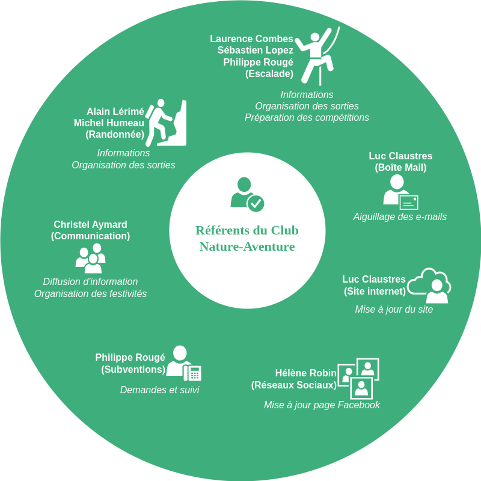

# Le Club

## Présentation

Le club Nature Aventure existe depuis plus de 20 ans et sa motivation à faire découvrir l’activité, former, faire progresser est toujours aussi grande que le premier jour. Il compte une dizaine d’encadrants diplomés, passionnés par leur discipline, et un total d'environ 80 membres. Ils proposent aux licenciés de multiples activités de pleine nature ainsi que des sports d’eau et de montagne : escalade, randonnée pédestre, ski de randonnée, course d'arête, etc. La section compétition brille régulièrement lors des trophés départementaux, régionaux ou même nationaux.

::: tip Pour plus d'information sur nos activités
Consultez la section [En Pratique](/pratique/).
:::

Notre club est dans le réseau CAF (Club Alpin Français), section du [CAFPA](http://pyreneiste.aude.ffcam.fr/home.html) et adhérent de la [FFCAM](http://ffcam.fr), fédération française des clubs alpins et de montagne. La FFCAM participe à la gestion et l'entretien des nombreux refuges CAF en France, ce qui permet aux adhérents de bénéficier de 50% de réduction pour les nuitées. Pour la partie compétition notre club est également adhérent de la [FFME](https://www.ffme.fr/), fédération française de la montagne et de l'escalade.

## Fonctionnement

### Le bureau

Notre bureau élargi assure la représentation du club et coordonnent son fonctionnement.

### Les référents

Les référents assurent les tâches quotidiennes de son fonctionnement.

